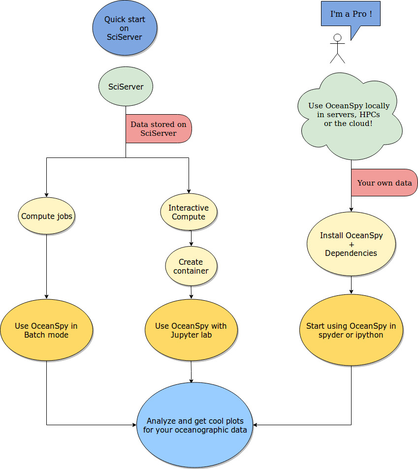

.. _quick:

===========
Quick Start
===========

This is a short introduction for using OceanSpy on the Johns Hopkins University SciServer_ system using sample datasets.

OceanSpy and its dependencies are preinstalled on SciServer. There is no need to download and install it unless you wish to run OceanSpy on your local machine or server. Steps to do that are described in the :ref:`installation` section.

The following steps explain how to navigate through the basics of OceanSpy on SciServer. Steps 1 to 5 describe how to create a container on SciServer with a set of example datasets to work on.

1. Go to `www.sciserver.org <http://www.sciserver.org/>`_.
2. Log in or create a new account.
3. Click on ``Compute``.
4. Click on ``Create container``, then use the following settings:

    .. list-table::
        :stub-columns: 0
        :widths: 60 60

        * - Domain:
          - Interactive Docker Compute Domain
        * - Compute Image:
          - Oceanography
        * - User volumes:
          - * persistent
            * scratch
        * - Data volumes:
          - Ocean Circulation

5. Click on ``Create``.

Steps 6 to 8 describe how to get started with using the container. Information about which directories to work in and their descriptions are detailed below the container images once they are created on SciServer.

6. Click on the name of the new container.
7. Click on ``Storage`` >> ``your_username`` >> ``persistent``.
8. Click on ``New`` >> ``Oceanography``.

Steps 9 to 15 demonstrate a subset of the commonly used OceanSpy commands.

9. Copy and paste the following lines in the first notebook cell to import OceanSpy, and open the get started dataset:

.. code-block:: ipython
    :class: no-execute
        
    import oceanspy as ospy
    od = ospy.open_oceandataset.from_catalog('get_started')

10. Use the following line to extract a limited geographic range of the dataset:

.. code-block:: ipython
    :class: no-execute

    od_cutout = od.subsample.cutout(YRange=[69.6, 71.4], XRange=[-21, -15], ZRange=[0, -100])

11. Use the following line to plot a map of weighted mean temperature:

.. code-block:: ipython
    :class: no-execute

    ax = od_cutout.plot.horizontal_section(varName='Temp', meanAxes=['Z', 'time'], center=False)

12. Use the following line to compute the potential density anomaly:

.. code-block:: ipython
    :class: no-execute
 
    od_cutout = od_cutout.compute.potential_density_anomaly()

13. Use the following line to store the cutout in netCDF format:

.. code-block:: ipython
    :class: no-execute

    od_cutout.to_netcdf('filename.nc')

14. The netCDF file can be download and used for post-processing offline, or kept on SciServer. Any software of choice can be used to re-open the netCDF file. To re-open the file using OceanSpy, use the following command:

.. code-block:: ipython
    :class: no-execute

    od_cutout = ospy.open_oceandataset.from_netcdf('filename.nc')

15. Opening the netCDF file using OceanSpy will allows the use of OceanSpy's functions whether it be on SciServer or a local machine. For example, the following line plots an animated TS diagram color-coded by potential density anomaly (computed in step 12):

.. code-block:: ipython
    :class: no-execute

    anim = od_cutout.animate.TS_diagram(colorName='Sigma0', meanAxes='Z')

The :ref:`get_started` is just a small cutout from a high-resolution realistic dataset.
Click :ref:`datasets` for a list of datasets available on SciServer.

Check out `Tutorial <Tutorial.ipynb#Tutorial>`_, Use Cases, and :ref:`api` to learn more about OceanSpy and its features, and feel free to open an `issue here <https://github.com/malmans2/oceanspy/issues>`_, or to send an email to `mattia.almansi@jhu.edu <mattia.almansi@jhu.edu>`_ if you have any questions.

The schematic below shows how OceanSpy is designed to be used by the oceanographic community.

.. _SciServer: http://www.sciserver.org/
